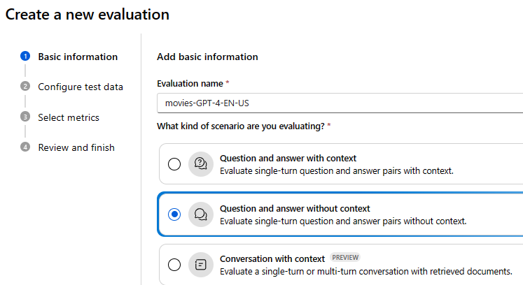
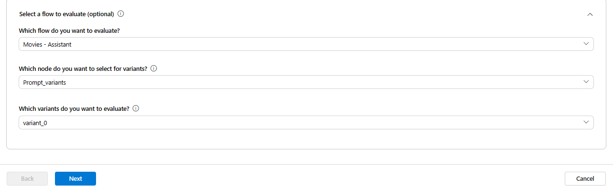
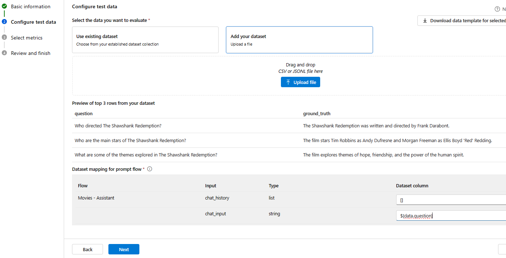
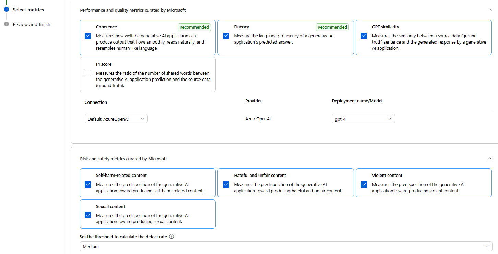
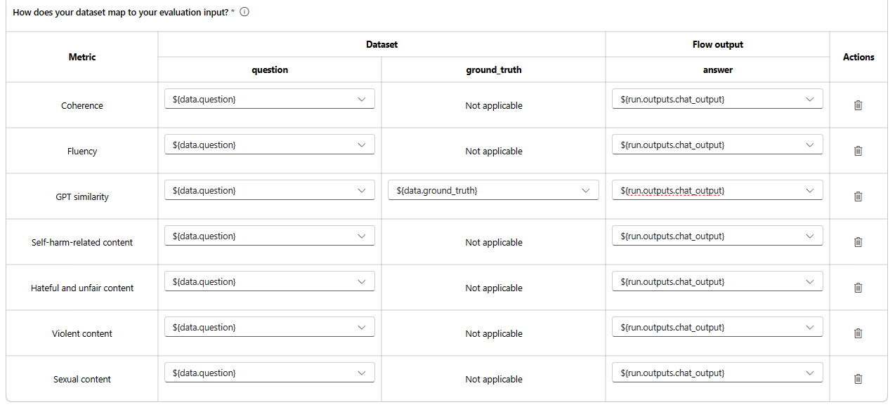
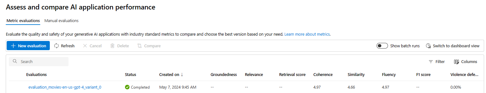
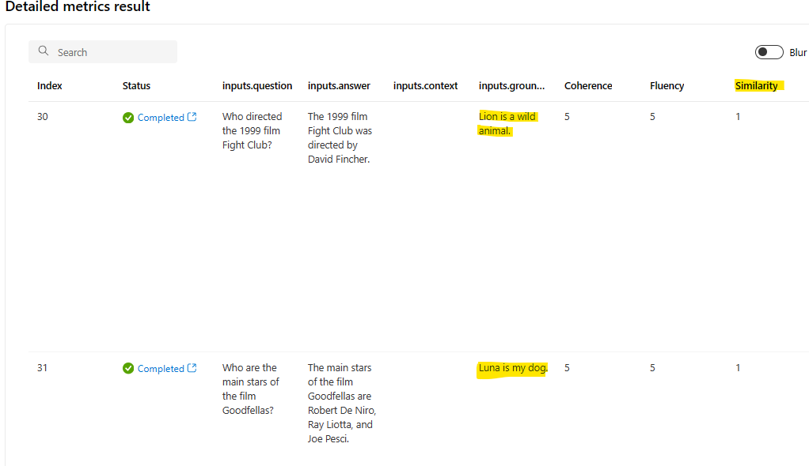

# Evaluate your LLMs using Synthetic Data Generation

This project is a framework to generate synthetic data and evaluate your LLMs. It is based on the [Azure AI SDK synthetic data generation](https://learn.microsoft.com/en-us/azure/ai-studio/how-to/generate-data-qa) and helps you to evaluate your LLMs on the generated data. This data can then be used for various purposes like unit testing for your LLM lookup, evaluation and iteration of retrieval augmented generation (RAG) flows, and prompt tuning.

We will use the dataset to create an evaluation project on Azure AI Studio.

Azure AI Studio provides a versatile hub for evaluating AI models. You can create an evaluation run from a test dataset (for example generated using this repo) or flow with built-in evaluation metrics from Azure AI Studio UI, or establish a custom evaluation flow and employ the custom evaluation feature.

We also provide a process to generate synthetic sample data (not only for evaluation purposes). In this example shown below, we will generate synthetic data for a *Movies assistant* application. The data contains synopses of movies and the corresponding genres. The data is generated using [Azure OpenAI](https://learn.microsoft.com/en-us/azure/ai-services/openai/) and a GPT-4 model.

## Getting Started

- The file [`simulate_movies_data.py`](simulate_movies_data.py) file contains the code to generate synthetic data for a Movies assistant application.
It executes the following steps:
  - Create an Azure AI Index
  - Generate synthetic data (movie synopses and genres) using Azure OpenAI (GPT-4 model)
  - Transform synopses and genres into a Vector representation
  - Ingest the data into the Azure AI Index

- The file [`simulate_qa_evaluation.py`](simulate_qa_evaluation.py) file contains the code to generate a synthetic dataset for evaluation purposes. It uses the movies index created in the previous step.

The processed datasets are available in the [`data`](./data/) folder.

## Create an Evaluation Project on Azure AI Studio and use the generated data to evaluate your LLMs

- Create an evaluation project on Azure AI Studio. Click on Build -> Evaluation -> New Evaluation

- Provide a name and select the scenario for the evaluation project.

- (OPTIONAL) You can also select a [Prompt Flow](https://learn.microsoft.com/en-us/azure/ai-studio/concepts/prompt-flow) for the evaluation project.

In this example, we will use a movies assistant prompt flow to provide the model's answers to the questions and be evaluated against the ground truth.

- On the next screen, you can select the dataset for the evaluation project. You can use the dataset generated using the `simulate_qa_evaluation.py` script. Use *Add your dataset* to upload the [`movies-generated-qa-EN-US.jsonl`] file.

In our example, we use a Prompt Flow solution to provide the model's answers to the questions and be evaluated against the ground truth. For this, we select the dataset column *`$(data.question)`*.

- Now we need to select the metrics. In this example we only use Bult-in metrics. You can also use custom metrics.

We use GPT-4 as the model for the evaluation project. You can select the model from the list of available models. We also added *Risk and safety" metrics to mitigate any potential risks regarding model's misuse.

- (OPTIONAL) As mentioned earlier, we use the Prompt Flow solution to provide the model's answers to the questions. We can map the output with the *GPT similarity* metric to evaluate the ground truth against the model's answers.

- Finally, you can submit the evaluation project and view the results.

In our example dataset we provided two samples with wrong ground truth answers to evaluate the model's GPT-similarity metric.
Notice that the results demonstrate a low performance for these two samples. It is expected as the ground truth answers are incorrect.

### Prerequisites

- You must have a Pay-As-You-Go Azure account with administrator — or contributor-level access to your subscription. If you don’t have an account, you can sign up for an account following the instructions.
- Get Access to Azure OpenAI
- Once got approved create an Azure OpenAI in you Azure’s subcription.
- You must have a Workspace of [Azure AI Studio](https://azure.microsoft.com/en-gb/products/ai-studio/)
- You must have the [Azure AI Search](https://learn.microsoft.com/en-us/azure/search/search-what-is-azure-search) service deployed in your Azure subscription.
- Python 3.11

### Install required Libs
`pip install -r requirements.txt`

## Resources

- [How to generate question and answer pairs from your source dataset](https://learn.microsoft.com/en-us/azure/ai-studio/how-to/generate-data-qa)
- [Evaluation of generative AI applications](https://learn.microsoft.com/en-us/azure/ai-studio/concepts/evaluation-approach-gen-ai)
